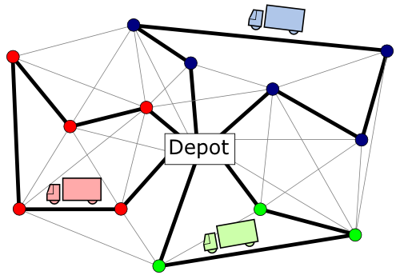
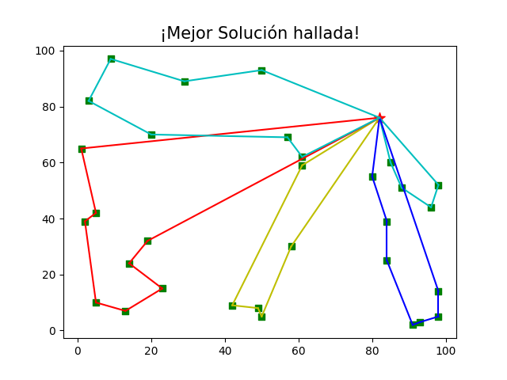
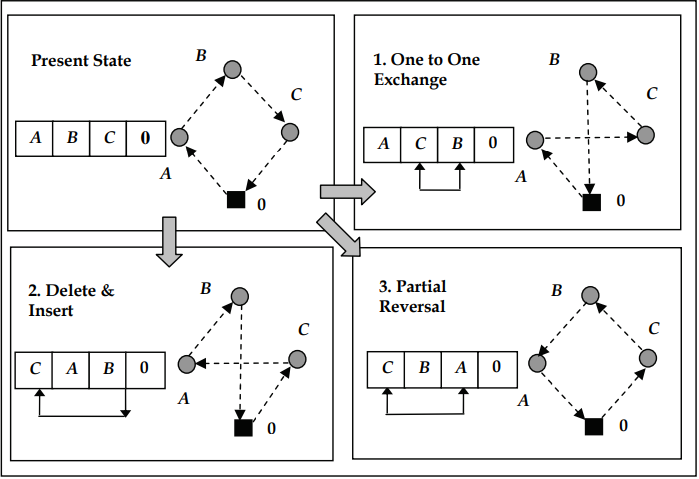

# TF - Inteligencia Artificial - Problema de enrutamiento de vehiculos con capacidad limitada (CVRP) #

## Problema de enrutamiento de vehiculos (VRP) 📋



## Pequeño Vistazo del programa



### Algoritmos
1. Algoritmo Voraz (Greedy) para generar solución inicial
2. Simulated Annealing (SA) ó Recocido Simulado
3. Algoritmos de Transformación (Intercambio, Reubicación, Inversión) para recorrer el espacio de búsqueda



### Pre-requisitos 🛠️

_Este proyecto utiliza propiedades de estas librerías._ 

* [Requests](https://requests.readthedocs.io/en/master/) - Documentación de Requests
* [Matplotlib](https://matplotlib.org/3.3.3/contents.html) - Documentación de Matplotlib


## Instalación y uso 🔧
_Estas instrucciones permitirán obtener una copia del proyecto en funcionamiento en una máquina local._

Debe de asegurarse de tener `Python` instalado en su ordenador desde la versión 3.0 para adelante y el instalador de paquetes `pip` o `conda`.

_Instalación de librerías_

```bash
pip install requests
pip install matplotlib
```

_Clonación del repositorio y ejecución de la aplicación_

```bash
git clone https://github.com/CFSanchezV/VRP-TF_IA/tree/master
cd VRP-TF_IA
python vrp.py
```


## Autores ✒️

* **Christian Sanchez** 
* **Fernando Valdiviezo** 
* **Frank Zegarra** 